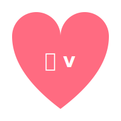

# 那些年我们爱过的小叽v

```python
def show_love():
    heart = """
         ooooooo          ooooooo
      ooooooooooooo    ooooooooooooo
    oooooooooooooooooooooooooooooooooo
    oooooooooooooooooooooooooooooooooo
    oooooooooooo    叽 v    ooooooooooo
     oooooooooooooooooooooooooooooooo
      oooooooooooooooooooooooooooooo
        oooooooooooooooooooooooooo
          oooooooooooooooooooooo
            oooooooooooooooooo
              oooooooooooooo
                oooooooooo
                  oooooo
                    oo
    """
    print(heart)

# Running...
# 叽 v
```

<div align="center">
  
</div>
